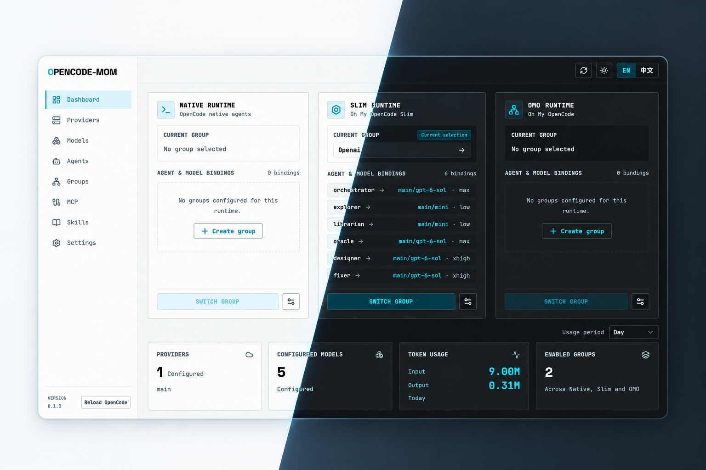

<div align="center">


# opencode-mom

**The model-group manager for OpenCode v2.**<br />
One window. Three runtimes — **Native**, **Slim**, **OMO**. One click to switch your whole agent setup, without losing a single hand-tuned config key.

[](https://github.com/seho-dev/opencode-mom/releases/latest)


[](https://github.com/seho-dev/opencode-mom/stargazers)

[English](README.md) · [简体中文](README.zh-CN.md)

</div>

> [!IMPORTANT]
> **opencode-mom only supports OpenCode v2.** MOM reads and writes the v2 config surface — `provider/model#variant` model selectors, v2 permission rules, and v2 provider/model schemas. V1 configs are neither migrated nor managed. Make sure your OpenCode install is on v2 before switching groups.

> [!NOTE]
> **⭐ A personal goal: 100 stars.**
> macOS builds currently use ad-hoc signing, not an Apple Developer ID certificate, and are not notarized. At 100 stars I plan to self-fund Apple Developer Program membership and work toward signed, notarized releases.
> If MOM has helped you, a Star is welcome but entirely optional: it never gates downloads or features, and is encouragement, not payment for a certificate. Thank you for supporting the project; you can also build and sign your own copy if you prefer.

> [!WARNING]
> **macOS first launch requires a deliberate trust decision.**
> After dragging `opencode-mom.app` into `/Applications`, try opening it once. If blocked, prefer **Open Anyway** in **System Settings → Privacy & Security**; this GUI step is normally sufficient.
>
> The command below is **not mandatory**. Only if a trusted official copy is still blocked, or **Open Anyway** is absent, consider this optional fallback to remove quarantine **only for this app**, without `sudo`:
>
> ```bash
> xattr -dr com.apple.quarantine "/Applications/opencode-mom.app"
> ```
>
> 🔒 Only consider these steps for a copy downloaded from this repository's official [Releases](https://github.com/seho-dev/opencode-mom/releases/latest) page after reviewing its source and release information. Do not bypass quarantine for an untrusted build or disable Gatekeeper globally.

<div align="center">



*MOM at a glance — Native, Slim and OMO runtimes, live CLI status, token usage and an activity heatmap, in light and dark.*

</div>

## 🌟 What is opencode-mom?

**opencode-mom** ("MOM") is a cross-platform desktop app that keeps a multi-runtime OpenCode v2 setup organized and instantly switchable. It manages named **model groups**, each binding providers, models, agents and categories for one of three runtimes:

- **Native** — OpenCode's own agents, written into `~/.config/opencode/opencode.jsonc` (or `opencode.json`).
- **Slim** — Oh My OpenCode Slim, written into `~/.config/opencode/oh-my-opencode-slim.json`.
- **OMO** — Oh My OpenAgent, written into `~/.omo/omo.jsonc`.

MOM never rewrites your configs wholesale: every write is a one-to-one key patch that leaves keys it doesn't own exactly as they were.

## ✨ Features

### 🧩 Model groups — switch everything in one click

- Named groups per runtime, with category mappings and per-agent model bindings, including `#variant` selection.
- Switch from the **Dashboard**, the **Groups** page, or the **tray popup**; the selected group is projected immediately.
- Live CLI health and working-session counts, plus a reload reminder after switches when OpenCode needs one.
- Non-destructive: hand-tuned keys are preserved, and changing a group's type removes only the keys that group owned.

### 🧠 Providers, models & agents

- **Providers** — register custom OpenAI-compatible, Anthropic or custom endpoints with API keys, base URLs and extra headers, all validated.
- **Models** — a catalog with modalities (text, audio, image, video, pdf), context limits, input/output/cache pricing and custom variants; models discovered from the CLI are merged in.
- **Agents** — browse the builtin catalog (24 agents across native / slim / omo) or define your own: mode, `provider/model#variant` selector, system prompt, color, and visual v2 permission rules (`allow` / `ask` / `deny`). Store definitions inline in config or as global Markdown.

### 🔌 MCP & 📚 Skills

- **MCP** — see every registered server across config sources, inspect diagnostics, keep credentials masked, edit raw JSON, and delete safely; file replacements leave recovery `.bak` snapshots.
- **Skills** — discover local and remote skills, view and edit content, watch diagnostics. Remote skills stay read-only.

### 📊 Dashboard, usage & tray

- Real-time status: active group and runtime, CLI health, running sessions.
- Token usage (input / output / cache) and an activity heatmap with daily, weekly, monthly and yearly views.
- Tray popup: switch groups, reload the OpenCode CLI, open the app or settings, quit. Closing the window hides MOM to the tray.

### 💤 Lid protection — work with the lid closed (macOS / Windows)

- Keeps the laptop awake **only while OpenCode sessions are actually working** in the CLI-connected service, then restores your original power policy automatically.
- macOS flips `SleepDisabled` through a bundled helper behind a one-time administrator authorization; Windows journals and restores the active power scheme's AC/DC lid-close actions.
- Covered by a manual lid-close acceptance checklist — automated tests do not replace it (see [Development](#-development)).

### 🌗 Native feel

- English / 简体中文 UI, dark (default) and light themes, launch-at-login, a single-window console plus a tray for quick access.

## 🏝️ Roadmap

- **MOM Island (macOS, planned)** — OpenCode on your Mac's notch / Dynamic Island, as a lightweight approvals-and-reminders layer: approve or deny an agent's tool call, get nudged when a session needs you, and glance at running work — all without leaving the window you're in.
- **Developer ID signed & notarized macOS builds** — planned, with self-funded membership at the personal goal of ⭐ 100 stars; stars do not purchase a certificate.

## 📦 Install

Grab the latest build from **[GitHub Releases](https://github.com/seho-dev/opencode-mom/releases/latest)**:

| Platform | Artifact |
| :--- | :--- |
| Windows (x64) | `opencode-mom_*_x64-setup.exe` — NSIS installer |
| macOS (Apple Silicon) | `opencode-mom_*_aarch64.dmg` |
| macOS (Intel) | `opencode-mom_*_x64.dmg` |

The workflow also provides `.app.tar.gz` archives for both macOS architectures. Windows installers are unsigned and may show a **SmartScreen** warning; review the publisher/source and only proceed for the official Release you intended to install.

### macOS first launch

Builds are ad-hoc signed but not Developer ID signed or notarized — **Open Anyway** in System Settings is preferred and normally sufficient; the scoped quarantine command above is only an optional fallback.

### Manual updates and Settings checks

**Settings** shows the actual running app version. Click **Check for updates** to compare stable `X.Y.Z` versions numerically against the latest stable GitHub Release. Results distinguish an available update, up to date, no published release, and errors; an unreadable or invalid version, network failure or rate limit is not confirmation that you are up to date. When an update is available, **View GitHub downloads** opens the official Releases page in your browser. Download and install manually: there are no automatic checks or installations.

- **macOS:** First choose **Quit** from the tray menu (closing the window only hides it). Download the Apple Silicon (`aarch64`) or Intel (`x64`) `.dmg` for your Mac, open it, drag `opencode-mom.app` into `/Applications` and choose **Replace**, then reopen the app. If blocked, follow the **Open Anyway** guidance above; the quarantine command is not a required update step.
- **Windows:** Quit MOM from the tray, then run the new unsigned NSIS `opencode-mom_*_x64-setup.exe` installer and reopen the app. Only proceed past **SmartScreen** if you trust the intended official Release download.

After reopening, verify that the actual version shown in **Settings** matches the Release you installed, and check launch-at-login and lid-protection status yourself. Enabling lid protection changes system power policy; use the manual acceptance checklist below rather than assuming an upgrade has verified it.

### Requirements

- **OpenCode v2** for CLI-powered features: status, sessions, model discovery, reload and token usage. MOM finds the binary via `$OPENCODE_BIN`, standard install locations, then `$PATH`.
- Editing configs works without the CLI; CLI features simply report as unavailable.

## 🔧 How MOM writes config

MOM keeps its own groups and selection state in `~/.config/opencode-mom/config.json`, separately from the files it manages:

| Group type | Target file | Patched keys |
| :--- | :--- | :--- |
| `native` | `~/.config/opencode/opencode.jsonc` (fallback `opencode.json`) | `agents.<name>.model` only |
| `slim` | `~/.config/opencode/oh-my-opencode-slim.json` | agent model bindings |
| `omo` | `~/.omo/omo.jsonc` | categories and agent overrides |

- **Non-destructive projection.** Keys outside the group definition are preserved as residual configuration. Selecting a different group or deleting a group leaves target files untouched; changing a group's type removes only the keys that group owned.
- **No silent backups.** Plain config writes do not create backups or locks; recovery `.bak` files exist only when MCP/skill files are replaced.
- **Overrides.** `OPENCODE_CONFIG_DIR` overrides the OpenCode config directory and `OPENCODE_CONFIG` pins an explicit managed file — which is also the highest-priority source for MCP and Skills discovery.
- **Skip when empty.** OpenCode sync is skipped when a group has no effective OpenCode overrides, so a missing OpenCode config only blocks operations that actually need it.

## 🛠️ Development

Requirements: Node.js 22.23.0 + npm, Rust ≥ 1.77.2 (CI/release pin 1.96.0), and the platform prerequisites for Tauri 2 desktop builds.

```bash
npm ci                # install dependencies
npm run tauri dev     # run the app in development
npm run tauri build   # package the current platform
```

Checks:

```bash
npm run check                 # Biome format + lint
npm run test:components      # Vitest component tests (jsdom)
npm run test:unit            # node --test unit tests
node --test scripts/release-version.test.mjs
cargo fmt --manifest-path src-tauri/Cargo.toml --all -- --check
cargo check --manifest-path src-tauri/Cargo.toml
cargo test --manifest-path src-tauri/Cargo.toml
```

Never edit generated output (`build/`, `.svelte-kit/`, `src-tauri/target/`, `src-tauri/gen/`).

### macOS lid helper

`src-tauri/build.rs` builds `src-tauri/native/macos-helper` as a standalone locked workspace, ad-hoc signs it, and embeds it. On a fresh Cargo cache, fetch it first:

```bash
cargo fetch --manifest-path src-tauri/native/macos-helper/Cargo.toml --locked
cargo fmt --manifest-path src-tauri/native/macos-helper/Cargo.toml --all -- --check
cargo check --manifest-path src-tauri/native/macos-helper/Cargo.toml --offline --locked
cargo test --manifest-path src-tauri/native/macos-helper/Cargo.toml --offline --locked
```

Do not run the helper directly or with `sudo`; its tests use mock policy backends.

<details>
<summary><b>Manual lid-protection acceptance (macOS / Windows)</b></summary>

🔒 This opt-in check changes real system power settings. Use only a laptop you control, save your work, keep it ventilated, and supervise brief trials. Never leave an awake, closed laptop in a bag. Keep the lid open unless the app confirms **Protected**; **Checking**, **Unknown** or **Error** is not confirmation. Only working sessions in the OpenCode service connected through the CLI are monitored.

1. Record the baseline with read-only commands: macOS `pmset -g` (`SleepDisabled`); Windows `powercfg /getactivescheme` and `powercfg /qh SCHEME_CURRENT SUB_BUTTONS` (including hidden AC/DC lid-close values).
2. macOS only: enable the setting and cancel the administrator prompt; confirm an error/non-protected state with an unchanged baseline. Restart the app before an approved authorization attempt. Windows has no equivalent app authorization prompt.
3. Enable protection, start a real CLI-connected working session, wait for **Protected** with a positive working-session count, close the lid briefly, reopen it, and verify the work continued.
4. Let all monitored work finish, wait for **Idle**, compare policy readback with the baseline, and confirm a brief lid close again follows the original behavior.
5. Repeat with **Quit MOM** while protected and compare the baseline after exit. Closing the main window only hides it to the tray; it is not an exit test.

If restoration is unconfirmed, keep the lid open and stop testing; restart the app for recovery. Automated tests and a successful policy readback do not replace real lid-close acceptance on each supported laptop/OS.

</details>

## 🚢 Release

The **Release** workflow runs on pushes to `main` (the current default branch), `v*` tag pushes, or **Actions → Release → Run workflow**. For commit-triggered releases on `main`, only the **HEAD commit subject** is inspected, case-sensitively:

- `release` or `release: description` → next patch version.
- `release: 2.1.0` → explicit stable `2.1.0` (the rule is `release: X.Y.Z`), strictly newer than the current app version and existing stable release tags. Malformed numeric versions, prereleases, equal versions and older versions are rejected. Each component must be `0..65535` for Windows VERSIONINFO compatibility; patch overflow is rejected.
- Subjects without the lowercase `release` word prefix (including `releases` and `chore: release`) do not release. No earlier commits in the push are scanned.
- Manual dispatch must target the default branch; its optional `version` input accepts stable `X.Y.Z`, or leave it empty for the next patch. If the default branch is renamed, update the workflow's push branch filter too.

Preparation updates `package.json`, both root version entries in `package-lock.json`, the app package in `src-tauri/Cargo.toml` and `src-tauri/Cargo.lock`, and `src-tauri/tauri.conf.json`. Preparation also prepends a new section to `CHANGELOG.md` using subjects of commits since the last stable tag (release commits excluded) and includes it in the release commit. It commits `chore(release): vX.Y.Z` and atomically pushes that commit and tag. The separate macOS helper keeps its own package version. Repository **Actions permissions** and branch/tag rules must allow this workflow's `GITHUB_TOKEN` to create that release commit and tag; protection rules are not bypassed.

Preparation is serialized and checks that the default-branch HEAD has not changed; a racing change rejects the push instead of overwriting it. A rerun reuses only the exact release child commit/tag from its original trigger. Rerun the failed run to retry a build without another bump. You can also push a pre-existing `vX.Y.Z` tag yourself: it must match **all** app version sources, and that path builds without bumping. Do not move published tags.

First merge the current `v2.0` work into default `main`, then trigger a release or push a release tag. App manifests use `2.0.0`; the corresponding tag is `v2.0.0`. From current `2.0.0`, `release` / `release: description` select `2.0.1`, while `release: 2.0.0` is rejected. To publish **current `2.0.0` unchanged**, merge without a release-prefixed subject and use the pre-existing tag path above: `v2.0.0` must point at the merged commit with all app version sources synced to `2.0.0`, rather than a bumping trigger.

The **same workflow run** then builds on `macos-15` (Apple Silicon), `macos-15-intel` (Intel) and `windows-2022` (x64 NSIS), using Node **22.23.0** and Rust **1.96.0**. macOS jobs prefetch the standalone helper's locked dependencies before its offline build. macOS uses ad-hoc signing identity `-`, without Developer ID signing or notarization; Windows is unsigned. No signing/updater secrets are required.

Build jobs have read-only repository permissions and upload artifacts. Only after **all three builds succeed** does a separate write-enabled job upload all five assets and publish the GitHub Release (a new release stays draft until uploads complete). Publication reruns replace matching assets rather than creating another release. Generated `GITHUB_TOKEN` pushes do not start another workflow, so the dependent build jobs are intentional. Validate the version logic locally with `node --test scripts/release-version.test.mjs`; actual hosted builds remain unverified until the workflow runs on GitHub.

## 📄 License

Released under the [MIT License](LICENSE). © 2026 seho-dev.
